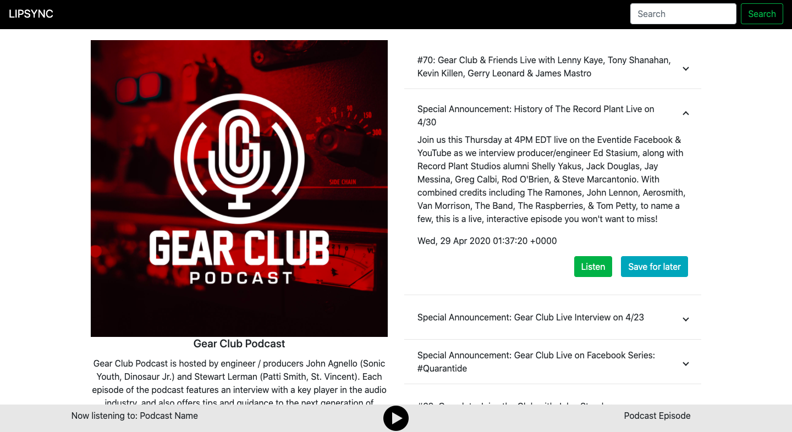

PodcastManager - Frontend 

This is the frontend of the podcast organizer app I built using Angular. It uses the exceptional Apollo Client GraphQL library to fetch and handle all the interactions with the backend.

TODOS:
  1) Improve styling in main page
  2) Position fixed on podcast image and description in the podcast page
  3) Advanced functions such as "Listen Later" and notifications
  4) Register & Login
  5) Keep the audio stream and player always active when navigating

LAUNCH INSTRUCTIONS:
  1) install angular cli (of course!)
  2) npm install
  3) ng serve
  
The associated backend is PodcastManager---Server
  
